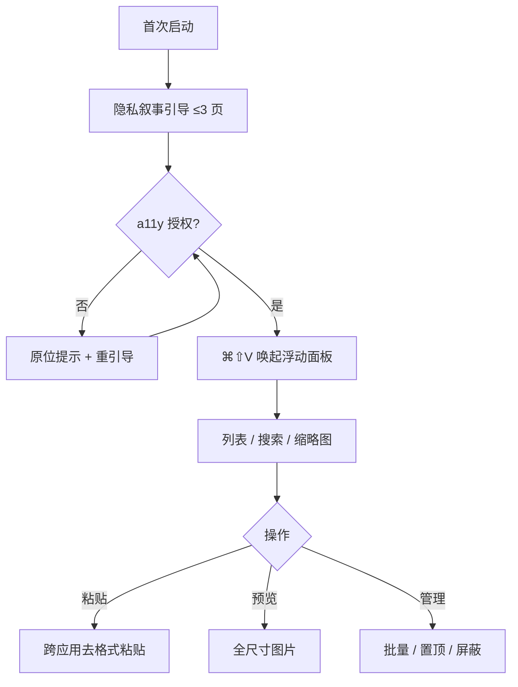

# EasyPaste 宏观功能规格书（PRD）

**日期**：2026-07-25
**类型**：PRD（功能规格书）
**参与成员**：瑞思（用户研究员）、竞析（竞品分析师）、数析（数据分析师）、析客（需求分析师）、路径（路线图规划师）

---

## 📌 TL;DR（执行摘要）

- **核心目标**：把 EasyPaste 定位为「本地优先隐私 + 轻量买断 + 图片预览」三位一体的 macOS 剪贴板管理工具，避开启动器赛道（Raycast/Alfred）与订阅云同步赛道（Paste）。
- **关键决策**：首个版本（v1.5，2026 Q3）聚焦 **P0 激活门禁与隐私可信**（R1 权限引导强化 + R2 敏感内容屏蔽 + R4 引导精简），以「辅助功能授权完成率 ≥ 60%」为北极星前置硬门槛；跨设备同步（R3）与 AI 整理（R7）延后至 2027。
- **下一步**：产品负责人拍板三项待确认（价格模式 / 跨设备同步是否做及选型 / AI 自研还是第三方），随后进入 v1.5 开发。

---

## 🎯 核心结论卡片

| 项目 | 内容 |
|------|------|
| 推荐方案 | v1.5 先打「激活+隐私可信」地基，再做稳定性与同步 |
| 优先级 | P0：R1、R2；P1：R3/R4/R5/R6；P2：R7/R8/R9 |
| 预期影响 | 北极星前置（授权完成率）≥60%，D7 留存向品类上沿（20–35%）靠拢 |
| 资源需求 | 1 名 macOS 工程师（全职）+ 0.5 设计；R3 若涉后端 +0.5 |
| 风险等级 | 中（a11y 授权摩擦、同步/AI 选型未定、Tahoe 系统级替代蚕食轻度用户） |

---

## 1. 产品目标（3 个清晰、正交的目标）

- **G1 本地优先持久化**：所有剪贴历史本地 GRDB 持久化，断网可用，明文不上云。
- **G2 零摩擦唤起粘贴**：⌘⇧V 全局唤起浮动面板，跨应用粘贴成功率高，面板 P95 延迟 < 200ms。
- **G3 隐私可信**：本地零遥测默认、敏感内容可屏蔽、隐私叙事激活，建立「信任级」用户心智。

## 2. 用户故事（3–5 个场景）

- **US1（阿哲 / 找回被覆盖内容）**：误覆盖代码后，⌘⇧V 唤起面板，搜索关键词秒回旧片段。
- **US2（林姐 / 可控去格式粘贴）**：跨应用粘贴时一键「去格式」，避免样式污染。
- **US3（小艾 / 图片即时预览粘贴）**：图片入历史即出缩略图，点开全尺寸预览并拖拽导出。
- **US4（防误覆盖）**：重要项可置顶 / 配置屏蔽规则防丢失，减少被覆盖焦虑。

## 3. 用户研究洞察（来自瑞思）

- **事实**：面向 macOS 高频复制粘贴人群（开发者 / 文字工作者 / 设计师 / 运营）；已修复面板滚动、缩略图性能、macOS 14 设置窗口可靠性；无云端账号 / 同步。
- **假设 Persona**：阿哲（日均 80+ 次，代码检索 / 去格式 / 历史不丢）、林姐（去格式 / 搜索 / 防误覆盖）、小艾（缩略图效率 / 原图预览 / 批量取用）。
- **假设 JTBD**：① 找回被覆盖内容 ② 跨应用可控去格式粘贴 ③ 搜索定位旧片段 ④ 图片预览粘贴 ⑤ 无感唤起重用。
- **假设未满足需求**：跨设备同步、敏感内容屏蔽、AI 整理、批量管理、容量与过期清理。
- **假设短板**：6 页引导偏长激活率低、a11y 授权摩擦大、缺预测性置顶、图片缺批量 / 拖拽导出。
- **核心结论**：跨设备同步 + 敏感内容屏蔽为最该优先补的「信任级」缺口（高优先级）；权限引导与激活流程是激活瓶颈。

## 4. 竞品对比（来自竞析，2026-07 联网核实）

| 产品 | 价格 | 同步 / 云 | 图片 | 定位 |
|------|------|-----------|------|------|
| Paste | $29.99/年 或 $90 买断 | Mac/iOS 云 | ✓ | 高颜值视觉 |
| Raycast | 免费 / Pro $8 月 | 启动器+剪贴板 | ✓ | 启动器赛道 |
| Alfred | 免费 / Powerpack £34 | 启动器+自动化 | ✓ | 启动器赛道 |
| Maccy | 免费开源 | 纯文本本地 | ✗ | 极简 |
| CopyClip 2 | $7.99 一次 | 轻量本地 | ✗ | 文本 |
| QuietClip | $8.99 买断 | 本地零遥测 | ✓ | 直面对手 |
| Tahoe 内置 | 免费（默认关） | 30分–7天 | ✗ 无图无跨应用 | 系统级轻量替代 |

**差异化定位**：本地优先隐私 + 轻量买断 + 图片预览三位一体，正面避开启动器与订阅云同步赛道；将引导转化为「隐私叙事」（明确本地存储、不上云），并把 Tahoe 内置区隔为「临时、无图、无跨应用」的轻量替代，强化 EasyPaste 的「持久化 + 图片 + 跨应用」区隔基线。

## 5. 数据依据（来自数析）

- **分层指标**：激活层（24h 首唤起率、a11y 授权完成率、激活完成率）/ 留存层（D1/D7/D30、WAU）/ 功能层（面板日唤起次数、剪贴项日均新增、⌘⇧V 渗透率、跨应用粘贴成功率、搜索使用率、图片类占比、类型分布）/ 价值层（付费转化率、重度用户占比、NPS、崩溃率、面板 P95 延迟）。
- **假设基准**：D7 留存 20–35%、D30 12–22%、a11y 授权完成率 40–65%、跨应用粘贴成功率 90–98%、⌘⇧V 渗透率 60–85%、搜索使用率 15–30%、图片类占比 10–25%、买断付费转化 3–8%、面板 P95 < 200ms。
- **埋点红线**：GRDB events 仅存非敏感元数据（type/length/尺寸）；剪贴内容不入库、不落盘明文、不上传；本地聚合 + opt-in 匿名上报。
- **北极星前置指标**：辅助功能授权完成率 ≥ 60%（P0 硬门槛），授权引导流程列 P0。

## 6. 需求池（P0/P1/P2 优先级）

| 编号 | 需求 | 优先级 | 验收标准 | 估算工作量 |
|------|------|--------|----------|------------|
| R1 | 权限引导强化（a11y 流程重做 + 隐私叙事） | **P0** | 首次启动弹隐私叙事→分步引导授权；未授权粘贴失败原位提示重引导；授权完成率 ≥ 60% | 1.5 人周 |
| R2 | 敏感内容屏蔽（按规则自动/手动，不入库不预览） | **P0** | 命中规则项不入历史/不预览；可白名单；本地零明文 | 1 人周 |
| R3 | 跨设备同步（端到端加密，默认关） | P1 | 依赖本地数据模型稳定；同账号跨设备可达；E2EE；默认关 | 4 人周+ |
| R4 | 引导精简（6 页 → ≤3 页 隐私叙事） | P1 | 激活完成率提升；24h 首唤起率 ≥ 基准上沿 | 0.5 人周 |
| R5 | 容量与过期清理（上限/天/条数 + 手动） | P1 | 达上限按策略清理；可配置；不误删置顶项 | 1 人周 |
| R6 | 批量管理（多选删除/置顶/分组） | P1 | 多选批量生效；分组持久化；可撤销 | 1.5 人周 |
| R7 | AI 整理（摘要/分类/标签，可选本地模型） | P2 | 触发生成分类；不上传内容 | 3 人周+ |
| R8 | 预测性置顶（高频/近期优先） | P2 | 唤起时相关项置顶；可关 | 1 人周 |
| R9 | 图片批量 / 拖拽导出 | P2 | 多选图片拖出导出原图；支持批量复制 | 1 人周 |

## 7. 关键流程图 / UI 设计稿

**面板布局**：顶部搜索框 + 类型筛选；中部滚动历史（缩略图 + 文本预览 + 时间戳）；右键菜单（置顶/屏蔽/删除/导出）；底部快捷提示。
**设置窗口（AppKit NSWindow）**：分组 = 通用 / 隐私与屏蔽 / 同步 / 容量清理 / 关于，隐私组默认可见。

## 8. Non-goals（明确不做什么）

- 不做启动器（避开 Raycast/Alfred 赛道）。
- 默认不做订阅云同步（仅做可选端到端加密同步，默认关）。
- 不存储剪贴明文上云（隐私红线）。
- 不做密码管理器。
- 不跨平台 Windows / 移动端（聚焦 macOS）。

## 9. 时间线 & 里程碑（来自路径）

| 季度 | 主题 | 关键交付(R) | 负责人(角色) | 风险 |
|------|------|------------|--------------|------|
| 2026 Q3 | 激活门禁 + 隐私可信 (v1.5) | R1, R2, R4 | 1 macOS 工程师 + 0.5 设计 | a11y 授权摩擦致激活率未达 60% |
| 2026 Q4 | 稳定性与批量基石 | R5, R6 | 1 macOS 工程师 + 0.5 设计 | 数据模型重构冲击存量用户 |
| 2027 Q1 | 跨设备同步 | R3 | 1 macOS 工程师（+后端协商） | 选型(iCloud/自建)未定；E2EE 复杂度 |
| 2027 Q2 | 智能增强 (v2+) | R7, R8, R9 | 1 macOS 工程师 + 0.5 设计 | AI 自研/第三方未定；Tahoe 蚕食 |

- **依赖说明**：R1 为「激活门禁」必须 Q3 先行，是后续所有功能解锁前提；R2/R4/R5/R6 可并行；R3 启动前置条件为本地数据模型稳定（R5/R6 完成），故置于 2027 Q1；R7/R8/R9 为 v2+，依赖 R1–R6 稳定。
- **资源假设**：1 名 macOS 工程师（全职）+ 0.5 设计单线推进；R3 若涉后端则 +0.5 后端。

## 10. 待确认问题

1. **价格模式**：免费 + 轻量买断（参考 QuietClip $8.99）还是纯买断？是否设 Pro 层？
2. **跨设备同步**：是否做？技术选型 iCloud（CloudKit）还是自建端到端加密？
3. **AI 整理**：自研本地模型还是接第三方？是否纳入 v1 范围？
4. **营收对齐**：重度用户占比与买断转化目标值是否需对齐营收模型？

---

## ✅ 行动清单

| # | 行动 | 负责方 | 时间窗 |
|---|------|--------|--------|
| 1 | 产品负责人拍板价格/同步/AI 三项待确认 | 产品负责人 | 本周内 |
| 2 | 启动 v1.5：R1 权限引导重做 + 隐私叙事 | macOS 工程师 + 设计 | 2026 Q3 |
| 3 | R2 敏感内容屏蔽（规则引擎 + 不入库） | macOS 工程师 | 2026 Q3 |
| 4 | R4 引导精简至 ≤3 页 | 设计 + 工程师 | 2026 Q3 |
| 5 | 埋点上线（本地 GRDB events，隐私红线） | 工程师 | 2026 Q3 同步 |
| 6 | R5/R6 稳定性与批量基石 | 工程师 + 设计 | 2026 Q4 |
| 7 | R3 跨设备同步（选型决策后启动） | 工程师（+后端） | 2027 Q1 |
| 8 | R7/R8/R9 智能增强 | 工程师 + 设计 | 2027 Q2 |

---

## ⚠️ 待确认 / 假设 / Non-goals

- **待确认**：价格模式、跨设备同步是否做及选型、AI 自研还是第三方、营收对齐目标。
- **假设**：用户画像、JTBD、未满足需求、品类基准指标值均为基于品类常识的推理，非真实埋点数据；竞品定价为 2026-07 联网核实。
- **Non-goals**：不做启动器、默认不做订阅云同步、不存储剪贴明文上云、不做密码管理器、不跨平台。

---

## 📚 数据来源 & 成员产出索引

- 瑞思（用户研究员）：目标用户画像、JTBD、未满足需求与满意度假设。
- 竞析（竞品分析师）：竞品全景图、功能对比矩阵、差异化机会（含 Tahoe 威胁）。
- 数析（数据分析师）：分层指标框架、假设基准值、本地优先埋点建议与北极星前置指标。
- 析客（需求分析师）：产品目标、用户故事、需求池 R1–R9、流程图/UI、Non-goals。
- 路径（路线图规划师）：季度路线图表、里程碑依赖、资源与风险、三版干系人沟通要点。

---

> 本报告由产品战略团队 AI 协作生成，重要决策请由产品负责人审定。
