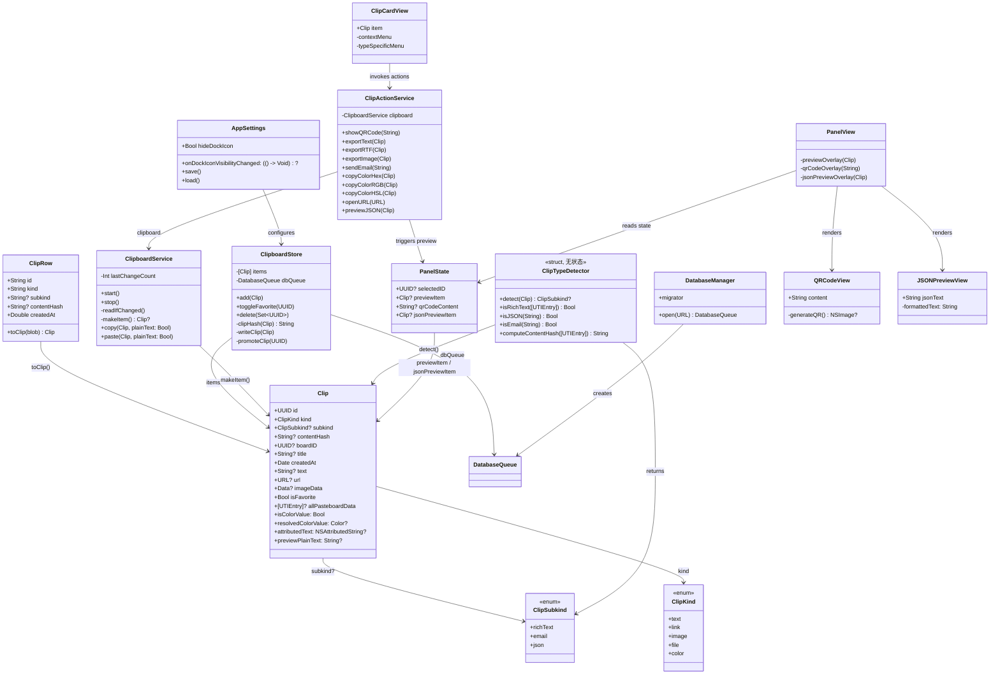
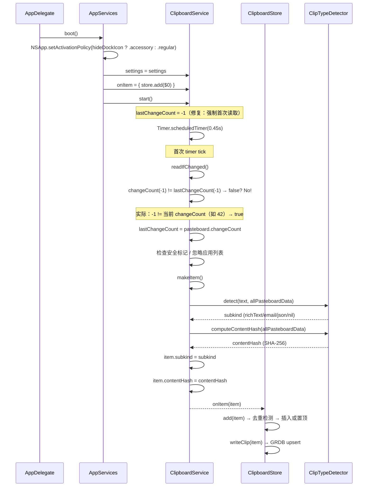
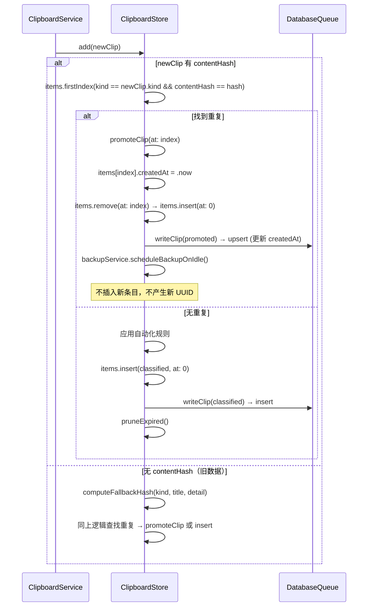
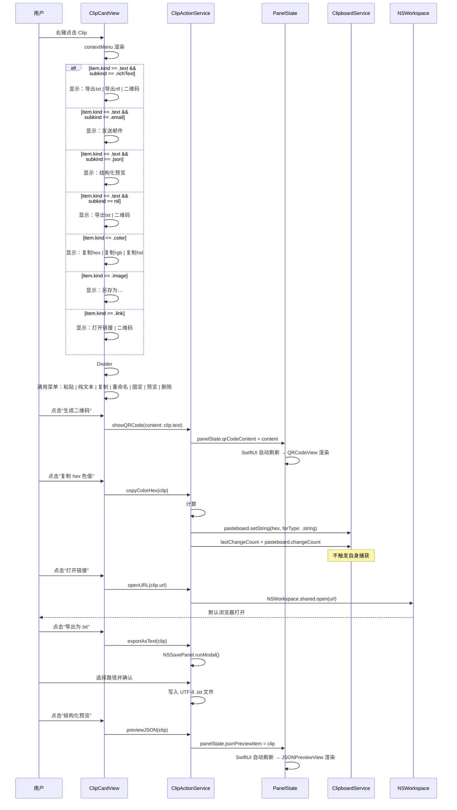
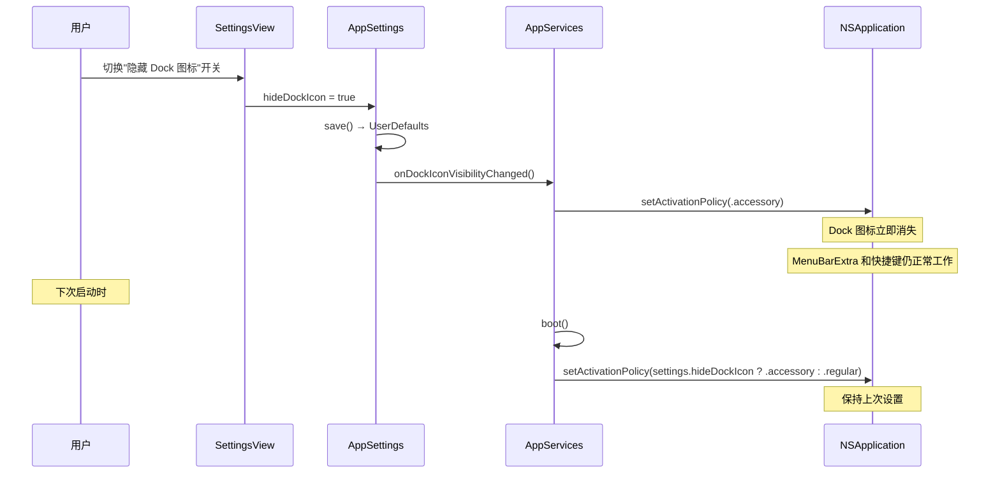
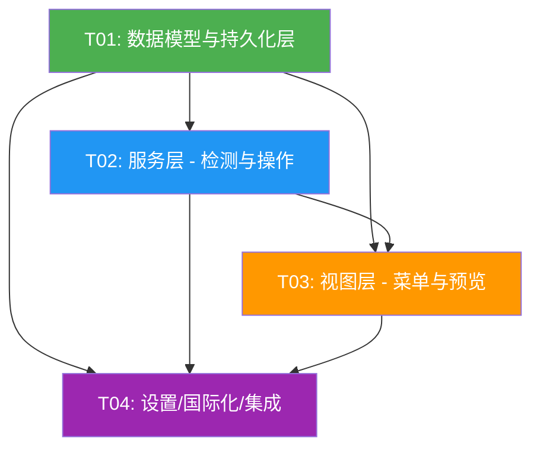

# EasyPaste 功能增强 — 系统架构设计 + 任务分解

> 架构师：高见远  
> 基于 PRD `docs/prd-ideas.md`，针对四项功能（启动读取剪贴板、Dock 隐藏、Clip 去重增强、多类型 Context Menu）进行系统设计。

---

## 目录

- [Part A: 系统设计](#part-a-系统设计)
  - [1. 实现方案](#1-实现方案)
  - [2. 文件列表](#2-文件列表)
  - [3. 数据结构和接口](#3-数据结构和接口)
  - [4. 程序调用流程](#4-程序调用流程)
  - [5. 待明确事项](#5-待明确事项)
- [Part B: 任务分解](#part-b-任务分解)
  - [6. 依赖包列表](#6-依赖包列表)
  - [7. 任务列表](#7-任务列表)
  - [8. 共享知识](#8-共享知识)
  - [9. 任务依赖图](#9-任务依赖图)

---

## Part A: 系统设计

### 1. 实现方案

#### 1.1 核心技术挑战

| 挑战 | 分析 | 方案 |
|------|------|------|
| **去重 hash 精度** | 当前 `clipHash()` 仅用 `uti:data.count`，不同内容相同长度被误判为重复 | 改用 `uti:SHA-256(data)` 组合计算，持久化 `contentHash` 列避免重复计算 |
| **去重行为变更** | 当前重复时直接 `return` 跳过，需改为更新 `createdAt` 并置顶 | 在 `add()` 中检测到重复时，更新已有条目的 `createdAt`、移至 `items[0]`、upsert 到 DB |
| **首次启动不读剪贴板** | `lastChangeCount` 在 `init` 时初始化为当前 `changeCount`，首次 tick 认为无变化 | 在 `start()` 中将 `lastChangeCount` 置为 `-1`，使首次 `readIfChanged()` 必然触发 |
| **Dock 隐藏与设置窗口冲突** | `openSettingsWindow()` 中硬编码 `NSApp.setActivationPolicy(.regular)`，会覆盖隐藏设置 | 改为根据 `settings.hideDockIcon` 决定 activation policy，设置窗口显示不再强制恢复 Dock |
| **子类型检测** | text 类型需细分为富文本/email/JSON，当前无子类型概念 | 新增 `ClipSubkind` 枚举 + `ClipTypeDetector` 服务，在 `makeItem()` 中检测并持久化 |
| **二维码生成** | 需无第三方依赖 | 使用 `CIFilter(name: "CIQRCodeGenerator")` 原生生成 |
| **多语言同步** | 10 个语言 JSON 文件需同步新增 key | 统一在 T04 中批量更新所有 JSON 文件 |

#### 1.2 框架与库选型

**不引入任何新的第三方依赖。** 所有功能均使用 macOS 原生框架实现：

| 功能 | 框架/API | 说明 |
|------|----------|------|
| 二维码生成 | `CoreImage.CIFilter` (`CIQRCodeGenerator`) | macOS 原生，无需第三方库 |
| 文件导出 | `AppKit.NSSavePanel` | 系统标准保存对话框 |
| 邮件发送 | `Foundation.URL` + `NSWorkspace.open` | `mailto:` URL scheme |
| JSON 格式化 | `Foundation.JSONSerialization` | `.prettyPrinted` 选项 |
| SHA-256 哈希 | `CommonCrypto.CC_SHA256` | 已在项目中使用（`Data.sha256Hex`） |
| 色值转换 | `AppKit.NSColor` | RGB → HSL 手动计算 |
| Dock 策略 | `AppKit.NSApplication.setActivationPolicy` | `.regular` / `.accessory` |

#### 1.3 架构模式

沿用现有 **分层 + 组合根** 架构，不做结构性变更：

```
App/ (组合根 EasyPasteApp + AppServices + AppDelegate)
 ├── Models/ (数据模型: Clip, AppSettings, PanelState, L10n, ...)
 ├── Stores/ (持久化: ClipboardStore, Database, DatabaseModels)
 ├── Services/ (业务服务: ClipboardService, ClipTypeDetector, ClipActionService, ...)
 └── Views/ (SwiftUI 视图: ClipCardView, PanelView, SettingsView, ...)
```

新增两个 Service 类，遵循现有 `@MainActor` + `@Observable` 模式：
- `ClipTypeDetector`：纯函数式子类型检测，无状态
- `ClipActionService`：执行类型专属操作（二维码、导出、邮件、色值复制等），持有 `ClipboardService` 弱引用以设置 `lastChangeCount`

---

### 2. 文件列表

#### 新增文件（4 个）

| 文件路径 | 说明 |
|----------|------|
| `Services/ClipTypeDetector.swift` | Clip 子类型检测器（富文本/email/JSON） |
| `Services/ClipActionService.swift` | 类型专属操作执行器（二维码/导出/邮件/色值/打开链接/JSON预览） |
| `Views/ClipboardPanel/QRCodeView.swift` | 二维码展示 SwiftUI 视图 |
| `Views/ClipboardPanel/JSONPreviewView.swift` | JSON 格式化预览 SwiftUI 视图 |

#### 修改文件（13 个 + 10 个 JSON）

| 文件路径 | 修改内容 |
|----------|----------|
| `Models/Clip.swift` | 新增 `ClipSubkind` 枚举；`Clip` 新增 `subkind: ClipSubkind?` 和 `contentHash: String?` 字段 |
| `Models/AppSettings.swift` | 新增 `hideDockIcon: Bool` 属性 + `onDockIconVisibilityChanged` 回调；`Snapshot` 增加对应字段 |
| `Models/PanelState.swift` | 新增 `qrCodeContent: String?`（二维码浮层内容）和 `jsonPreviewItem: Clip?`（JSON 预览条目） |
| `Models/L10n.swift` | 新增所有菜单项/设置项的 L10n 静态属性（约 15 个新 key） |
| `Stores/Database.swift` | 新增 migration `v1.0.3-contentHash-subkind`：`clips` 表增加 `contentHash`(TEXT) 和 `subkind`(TEXT) 列 |
| `Stores/DatabaseModels.swift` | `ClipRow` 增加 `contentHash`、`subkind` 字段映射；`init(_:)` 和 `toClip()` 双向编解码 |
| `Stores/ClipboardStore.swift` | 重写 `clipHash()` 为基于实际内容的 SHA-256；`add()` 改为"更新置顶"逻辑而非"跳过" |
| `Services/ClipboardService.swift` | `start()` 修复首次启动读取（`lastChangeCount = -1`）；`makeItem()` 中调用 `ClipTypeDetector` 设置 `subkind` 和 `contentHash` |
| `Views/ClipboardPanel/ClipCardView.swift` | `contextMenu` 按类型分化，通用菜单保留；新增类型专属菜单回调 |
| `Views/ClipboardPanel/PanelView.swift` | `previewOverlay` 增加 QR 码和 JSON 预览分支 |
| `Views/SettingsView.swift` | General section 新增"隐藏 Dock 图标"Toggle |
| `App/EasyPasteApp.swift` | `boot()` 应用 `hideDockIcon` 策略；`openSettingsWindow()` 不再强制 `.regular`；注册 `onDockIconVisibilityChanged` 回调 |
| `L10n/en.json` | 新增约 15 个 L10n key（英文） |
| `L10n/zh-Hans.json` | 同步新增 key（简体中文） |
| `L10n/zh-Hant.json` | 同步新增 key（繁体中文） |
| `L10n/ja.json` | 同步新增 key（日语） |
| `L10n/ko.json` | 同步新增 key（韩语） |
| `L10n/fr.json` | 同步新增 key（法语） |
| `L10n/es.json` | 同步新增 key（西班牙语） |
| `L10n/pt.json` | 同步新增 key（葡萄牙语） |
| `L10n/ru.json` | 同步新增 key（俄语） |
| `L10n/de.json` | 同步新增 key（德语） |

---

### 3. 数据结构和接口

#### 3.1 类图



#### 3.2 关键类型定义

##### ClipSubkind（新增枚举）

```swift
/// text 类型的子类型，用于 Context Menu 分化。
/// nil 表示普通纯文本。
enum ClipSubkind: String, Codable {
    case richText     // 富文本（含 RTF/RTFD/HTML 原始格式数据）
    case email        // 邮箱地址
    case json         // JSON 格式文本
}
```

##### Clip（增强字段）

```swift
struct Clip: Codable, Identifiable, Hashable {
    // ... 现有字段不变 ...
    
    /// text 类型的子类型（richText / email / json），nil = 普通纯文本。
    /// 在 makeItem() 中由 ClipTypeDetector 检测并持久化。
    var subkind: ClipSubkind? = nil
    
    /// 基于实际内容的 SHA-256 hash，用于去重。
    /// 由 ClipTypeDetector.computeContentHash() 在创建时计算。
    var contentHash: String? = nil
}
```

##### AppSettings（增强字段）

```swift
@Observable @MainActor
final class AppSettings {
    // ... 现有字段不变 ...
    
    /// 隐藏 Dock 图标。true = .accessory, false = .regular。
    var hideDockIcon = false { didSet { save(); onDockIconVisibilityChanged?() } }
    
    var onDockIconVisibilityChanged: (() -> Void)?
    
    // Snapshot 中新增：
    // var hideDockIcon: Bool
}
```

##### ClipTypeDetector（新增服务）

```swift
/// Clip 子类型检测器：纯函数式，无状态，可安全在任意上下文调用。
struct ClipTypeDetector {
    
    /// 检测 text 类型的子类型。
    /// 按优先级：richText > json > email > nil(普通文本)
    /// 注意：颜色值检测在 makeItem() 中已将 kind 重分类为 .color，不进入此函数。
    static func detect(text: String?, allPasteboardData: [UTIEntry]?) -> ClipSubkind?
    
    /// 判断是否为富文本：allPasteboardData 含 public.rtf / com.apple.flat-rtfd / public.html
    static func isRichText(_ entries: [UTIEntry]?) -> Bool
    
    /// 判断是否为 JSON：首字符为 { 或 [，且 JSONSerialization 可解析
    static func isJSON(_ text: String) -> Bool
    
    /// 判断是否为 email：匹配 ^[A-Za-z0-9._%+-]+@[A-Za-z0-9.-]+\.[A-Za-z]{2,}$
    static func isEmail(_ text: String) -> Bool
    
    /// 基于 allPasteboardData 的实际内容计算 SHA-256 hash。
    /// 对每个 UTIEntry 计算 "uti:sha256(data)"，排序后拼接再 SHA-256。
    static func computeContentHash(_ entries: [UTIEntry]?) -> String?
    
    /// 对无 allPasteboardData 的旧数据，用 displayTitle + detail 生成回退 hash。
    static func computeFallbackHash(kind: ClipKind, title: String?, detail: String) -> String
}
```

##### ClipActionService（新增服务）

```swift
/// 执行 Clip 类型专属操作的 Action 服务。
/// 持有 ClipboardService 弱引用，以便在写入剪贴板后同步 lastChangeCount。
@MainActor
final class ClipActionService {
    private weak var clipboard: ClipboardService?
    private weak var panelState: PanelState?
    
    init(clipboard: ClipboardService, panelState: PanelState)
    
    // ── 二维码 ──
    /// 在面板预览浮层中展示二维码。
    func showQRCode(content: String)
    
    // ── 文件导出 ──
    /// 导出为 .txt 文件（text / 富文本）
    func exportAsText(_ clip: Clip)
    /// 导出为 .rtf 文件（仅富文本）
    func exportAsRTF(_ clip: Clip)
    /// 另存为图片文件（image）
    func exportAsImage(_ clip: Clip)
    
    // ── 邮件 ──
    /// 打开 mailto: 链接
    func sendEmail(to address: String)
    
    // ── 色值复制 ──
    /// 复制 hex 色值到剪贴板（不触发自身捕获）
    func copyColorHex(_ clip: Clip)
    /// 复制 rgb 色值
    func copyColorRGB(_ clip: Clip)
    /// 复制 hsl 色值
    func copyColorHSL(_ clip: Clip)
    
    // ── URL ──
    /// 在默认浏览器中打开链接
    func openURL(_ url: URL)
    
    // ── JSON 预览 ──
    /// 在面板预览浮层中展示格式化 JSON
    func previewJSON(_ clip: Clip)
}
```

##### PanelState（增强字段）

```swift
@Observable @MainActor
final class PanelState {
    // ... 现有字段不变 ...
    
    /// 二维码浮层内容。非 nil 时面板展示 QRCodeView。
    var qrCodeContent: String?
    
    /// JSON 预览浮层条目。非 nil 时面板展示 JSONPreviewView。
    var jsonPreviewItem: Clip?
}
```

##### ClipboardStore.add()（增强逻辑）

```swift
func add(_ item: Clip) {
    // 基于 contentHash 去重
    if let hash = item.contentHash {
        if let existingIndex = items.firstIndex(where: { 
            $0.kind == item.kind && $0.contentHash == hash 
        }) {
            // 重复：更新 createdAt 为当前时间，移至列表最前
            promoteClip(at: existingIndex)
            return
        }
    } else {
        // 无 contentHash 的旧数据回退到 displayTitle + detail 去重
        let fallbackHash = ClipTypeDetector.computeFallbackHash(
            kind: item.kind, title: item.displayTitle, detail: item.detail)
        if let existingIndex = items.firstIndex(where: {
            $0.kind == item.kind && 
            ($0.contentHash ?? ClipTypeDetector.computeFallbackHash(
                kind: $0.kind, title: $0.displayTitle, detail: $0.detail)) == fallbackHash
        }) {
            promoteClip(at: existingIndex)
            return
        }
    }
    
    // 非重复：正常插入
    var classified = item
    if let match = rules.first(where: { $0.matches(item) }) { 
        classified.boardID = match.targetBoardID 
    }
    items.insert(classified, at: 0)
    writeClip(classified)
    pruneExpired()
    backupService.scheduleBackupOnIdle()
}

/// 将已有条目更新 createdAt 并移至列表最前。
private func promoteClip(at index: Int) {
    items[index].createdAt = .now
    let promoted = items.remove(at: index)
    items.insert(promoted, at: 0)
    writeClip(promoted)  // upsert 到 DB，更新 createdAt
    backupService.scheduleBackupOnIdle()
}
```

##### clipHash() 增强

```swift
/// 基于 allPasteboardData 实际内容计算 SHA-256 hash。
/// 对每个 UTIEntry 计算 "uti:sha256(data)"，排序后拼接再 SHA-256。
/// 确保不同内容即使数据长度相同也不会碰撞。
private func clipHash(_ clip: Clip) -> String {
    ClipTypeDetector.computeContentHash(clip.allPasteboardData) 
        ?? ClipTypeDetector.computeFallbackHash(
            kind: clip.kind, title: clip.displayTitle, detail: clip.detail)
}
```

##### ClipRow（增强字段）

```swift
struct ClipRow: FetchableRecord, PersistableRecord, Codable {
    // ... 现有字段不变 ...
    let contentHash: String?    // 新增
    let subkind: String?        // 新增
    
    init(_ clip: Clip) {
        // ... 现有映射不变 ...
        contentHash = clip.contentHash
        subkind = clip.subkind?.rawValue
    }
    
    func toClip(blob: ClipBlobRow?) -> Clip {
        var clip = Clip(...)
        // ... 现有还原不变 ...
        clip.contentHash = contentHash
        clip.subkind = subkind.flatMap { ClipSubkind(rawValue: $0) }
        return clip
    }
}
```

##### Database Migration

```swift
// v1.0.3：持久化内容 hash + 子类型
migrator.registerMigration("v1.0.3-contentHash-subkind") { db in
    let columns = try db.columns(in: "clips")
    if !columns.contains(where: { $0.name == "contentHash" }) {
        try db.alter(table: "clips") { t in
            t.add(column: "contentHash", .text).indexed()
        }
    }
    if !columns.contains(where: { $0.name == "subkind" }) {
        try db.alter(table: "clips") { t in
            t.add(column: "subkind", .text)
        }
    }
}
```

---

### 4. 程序调用流程

#### 4.1 启动读取剪贴板（时序图）



#### 4.2 去重置顶流程（时序图）



#### 4.3 多类型 Context Menu 操作流程（时序图）



#### 4.4 Dock 隐藏切换流程



---

### 5. 待明确事项

| # | 问题 | 当前假设 | 影响 |
|---|------|----------|------|
| 1 | 启动读取时机：仅冷启动 vs 也含 reopen？ | **仅冷启动**（`applicationDidFinishLaunching` → `boot()` → `clipboard.start()`），`applicationShouldHandleReopen` 不触发读取 | `ClipboardService.start()` 中 `lastChangeCount = -1` 只在 start 调用时设置 |
| 2 | Dock 隐藏后打开设置窗口是否恢复 Dock？ | **不恢复**。`openSettingsWindow()` 中删除 `NSApp.setActivationPolicy(.regular)`，改为根据 `hideDockIcon` 决定 | 隐藏 Dock 时设置窗口仍可显示，但 Dock 不出现 |
| 3 | `subkind` 是否持久化到数据库？ | **持久化**。新增 `subkind` 列，在 `makeItem()` 中检测并存储，避免每次加载重新检测 | 需要 DB migration |
| 4 | `contentHash` 是否持久化？ | **持久化**。新增 `contentHash` 列并建索引，避免每次 `add()` 重算所有条目的 hash | 需要 DB migration + 索引 |
| 5 | 二维码展示方式 | **复用 PanelState 浮层机制**，新增 `qrCodeContent` 状态字段，在 `PanelView` 的 ZStack 中渲染 `QRCodeView` | 不新建独立窗口 |
| 6 | JSON 预览方式 | **复用 PanelState 浮层机制**，新增 `jsonPreviewItem` 状态字段，渲染 `JSONPreviewView` | 不新建独立窗口 |
| 7 | 颜色 rgb/hsl 格式 | rgb 用 `rgb(255, 128, 0)`（0-255 整数）；hsl 用 `hsl(30, 100%, 50%)`（度/百分比） | `ClipActionService` 中实现转换 |
| 8 | JSON 预览是否支持折叠/展开 | **P2 先做简单 `.prettyPrinted` 格式化**，树形折叠作为后续迭代 | `JSONPreviewView` 用 ScrollView + Text |
| 9 | 富文本导出 RTF 是否包含内嵌图片 | **P2 仅支持 .rtf**（不含图片），RTFD 作为后续迭代 | `exportAsRTF()` 用 `.rtf` documentType |
| 10 | email 正则是否支持 Unicode 域名 | **P2 先用 ASCII 正则**，Unicode 支持后续迭代 | `ClipTypeDetector.isEmail()` 用 ASCII 正则 |
| 11 | 大文本二维码 | 文本过长时二维码过密无法扫描 — **在 QRCodeView 中检测并提示** | `QRCodeView` 中判断 content.count > 500 时显示警告 |
| 12 | 历史数据 contentHash 回填 | 旧数据无 contentHash — **在 `add()` 中用 fallback hash（displayTitle + detail）**，不做批量回填迁移 | 运行时兼容，无额外迁移步骤 |

---

## Part B: 任务分解

### 6. 依赖包列表

**无新增第三方依赖。** 所有功能使用 macOS 原生框架：

```
# 已有依赖（不变）
- GRDB.swift@7.11.1: SQLite 封装（已在 Package.swift）
- Sparkle@2.9.4: 自动更新（已在 Package.swift）

# 原生框架（无需声明）
- CoreImage: CIFilter CIQRCodeGenerator（二维码生成）
- AppKit: NSSavePanel, NSWorkspace, NSPasteboard, NSApplication
- Foundation: JSONSerialization, URL, Data
- CommonCrypto: CC_SHA256（已在项目中使用）
- SwiftUI: 视图层
```

---

### 7. 任务列表

#### T01: 数据模型与持久化层

- **Task ID**: T01
- **Task Name**: 数据模型与持久化层（ClipSubkind + contentHash + hideDockIcon + DB migration + 去重增强）
- **Source Files**:
  - `Models/Clip.swift`（新增 `ClipSubkind` 枚举，`Clip` 新增 `subkind` / `contentHash` 字段）
  - `Models/AppSettings.swift`（新增 `hideDockIcon` 属性 + `onDockIconVisibilityChanged` 回调 + Snapshot 编解码）
  - `Stores/Database.swift`（新增 migration `v1.0.3-contentHash-subkind`）
  - `Stores/DatabaseModels.swift`（`ClipRow` 新增 `contentHash` / `subkind` 字段映射）
  - `Stores/ClipboardStore.swift`（重写 `clipHash()` 为内容 hash；`add()` 改为"更新置顶"逻辑；新增 `promoteClip(at:)`）
- **Dependencies**: 无（基础层，所有其他任务依赖此任务）
- **Priority**: P0

#### T02: 服务层 — 检测、启动读取与操作执行

- **Task ID**: T02
- **Task Name**: 服务层（ClipTypeDetector + ClipActionService + ClipboardService 启动修复 + PanelState 状态扩展）
- **Source Files**:
  - `Services/ClipTypeDetector.swift`（**新增**：子类型检测 + contentHash 计算）
  - `Services/ClipActionService.swift`（**新增**：二维码/导出/邮件/色值复制/打开链接/JSON预览）
  - `Services/ClipboardService.swift`（`start()` 修复首次读取；`makeItem()` 中调用 `ClipTypeDetector` 设置 `subkind` 和 `contentHash`）
  - `Models/PanelState.swift`（新增 `qrCodeContent` / `jsonPreviewItem` 状态字段）
- **Dependencies**: T01
- **Priority**: P0

#### T03: 视图层 — 上下文菜单与预览组件

- **Task ID**: T03
- **Task Name**: 视图层（ClipCardView contextMenu 分化 + PanelView 预览浮层 + QRCodeView + JSONPreviewView）
- **Source Files**:
  - `Views/ClipboardPanel/ClipCardView.swift`（`contextMenu` 按类型分化，通用菜单保留，新增类型专属菜单回调）
  - `Views/ClipboardPanel/PanelView.swift`（`previewOverlay` 增加 QR 码和 JSON 预览分支）
  - `Views/ClipboardPanel/QRCodeView.swift`（**新增**：CIFilter 生成二维码 + 展示视图）
  - `Views/ClipboardPanel/JSONPreviewView.swift`（**新增**：JSONSerialization 格式化展示视图）
- **Dependencies**: T01, T02
- **Priority**: P1

#### T04: 设置界面、国际化与启动集成

- **Task ID**: T04
- **Task Name**: 设置界面 + 10 语言国际化 + 组合根集成（Dock 隐藏 Toggle + L10n keys + AppServices boot 接线）
- **Source Files**:
  - `App/EasyPasteApp.swift`（`boot()` 应用 `hideDockIcon` 策略；`openSettingsWindow()` 不再强制 `.regular`；注册 `onDockIconVisibilityChanged` 回调）
  - `Views/SettingsView.swift`（General section 新增"隐藏 Dock 图标"Toggle）
  - `Models/L10n.swift`（新增约 15 个 L10n 静态属性）
  - `L10n/en.json`（新增 key）
  - `L10n/zh-Hans.json`（新增 key）
  - `L10n/zh-Hant.json`（新增 key）
  - `L10n/ja.json`（新增 key）
  - `L10n/ko.json`（新增 key）
  - `L10n/fr.json`（新增 key）
  - `L10n/es.json`（新增 key）
  - `L10n/pt.json`（新增 key）
  - `L10n/ru.json`（新增 key）
  - `L10n/de.json`（新增 key）
- **Dependencies**: T01, T02, T03
- **Priority**: P1

---

### 8. 共享知识

#### 数据约定

- **contentHash 算法**：对 `allPasteboardData` 中每个 `UTIEntry` 计算 `"uti:sha256hex(data)"`，按 UTI 字母排序后用 `|` 拼接，再对拼接结果做一次 SHA-256。确保不同内容即使数据长度相同也不会碰撞。
- **contentHash 回退**：无 `allPasteboardData` 的旧数据，用 `"kind:displayTitle:detail"` 的 SHA-256 作为 fallback hash。在 `add()` 中同时比较 stored hash 和 fallback hash。
- **subkind 优先级**：richText > json > email > nil。在 `ClipTypeDetector.detect()` 中按此顺序检测，命中即返回。
- **颜色值不进入 subkind 检测**：`isColorValue == true` 的文本在 `makeItem()` 中已被重分类为 `kind = .color`，不会进入 text 的 subkind 检测流程。
- **所有 GRDB 访问在 `@MainActor`**：`DatabaseQueue` 为 Sendable，但所有读写操作通过 `ClipboardStore`（`@MainActor`）序列化。

#### 剪贴板写入约定

- **写入剪贴板后必须同步 `lastChangeCount`**：`ClipActionService` 中所有"复制色值"操作在 `pasteboard.setString()` 后，必须调用 `clipboard.lastChangeCount = pasteboard.changeCount`，否则会触发 EasyPaste 自身的内容捕获。
- **`lastChangeCount` 修复**：`ClipboardService.start()` 中将 `lastChangeCount` 置为 `-1`（而非当前 `changeCount`），使首次 timer tick 的 `readIfChanged()` 必然触发读取。

#### Dock 隐藏约定

- **`openSettingsWindow()` 不再调用 `NSApp.setActivationPolicy(.regular)`**：改为 `if !settings.hideDockIcon { NSApp.setActivationPolicy(.regular) }`，隐藏 Dock 时保持 `.accessory`。
- **`boot()` 中根据 `hideDockIcon` 设置初始策略**：`NSApp.setActivationPolicy(settings.hideDockIcon ? .accessory : .regular)`。
- **`onDockIconVisibilityChanged` 回调**：`AppSettings` 属性变更时触发，`AppServices` 注册回调执行 `NSApp.setActivationPolicy()`。

#### Context Menu 约定

- **通用菜单始终保留**：粘贴/纯文本粘贴/复制/重命名/固定到看板/预览/删除，在所有类型下不变。
- **类型专属菜单在通用菜单之前展示**：以 `Divider()` 分隔。
- **空内容禁用**：text 类型内容为空时，导出和二维码操作不显示（不是禁用灰色，而是不渲染）。
- **QR 码和 JSON 预览复用 PanelState 浮层**：通过 `panelState.qrCodeContent` / `panelState.jsonPreviewItem` 触发，在 `PanelView` 的 ZStack 中渲染。

#### 国际化约定

- **新增 L10n key 命名规范**：
  - 菜单项：`clip.menu.<action>`（如 `clip.menu.export_txt`, `clip.menu.qr_code`, `clip.menu.copy_hex`）
  - 设置项：`settings.<name>`（如 `settings.hide_dock_icon`）
  - 预览提示：`clip.preview.<name>`（如 `clip.preview.json_error`, `clip.preview.qr_too_long`）
- **10 个语言 JSON 文件同步更新**：英文为基准，其他语言提供翻译。缺失 key 自动回退到英文。

#### 文件导出约定

- **默认文件名**：`clip_<yyyyMMdd_HHmmss>.<ext>`（如 `clip_20250115_143022.txt`）
- **NSSavePanel**：允许用户选择路径，取消时静默返回。
- **图片导出**：直接写入原始 `imageData`（不转码），根据 `clip.uti` 推断扩展名（png/jpeg/heic/tiff）。

---

### 9. 任务依赖图



**关键路径**：T01 → T02 → T03 → T04（线性依赖链，但 T04 也直接依赖 T01/T02，T03 也直接依赖 T01）

**并行可能性**：T01 完成后，T02 和 T04 的部分工作（L10n key 定义、SettingsView Toggle）可并行。但为保证一致性，建议按序执行。
