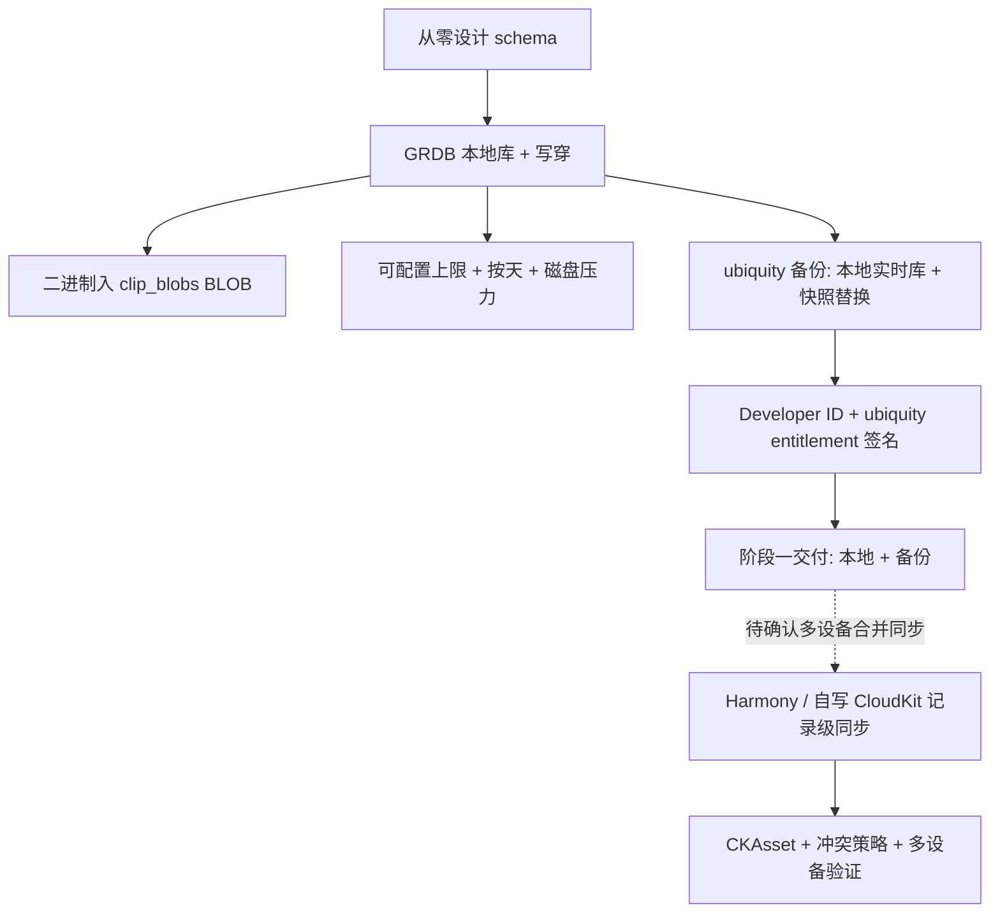

# EasyPaste 持久层迁移架构评审报告

> 评审人：高见远（架构师）  |  范围：把当前「JSON 文件持久化」迁移到数据库的架构方案对比与分阶段实施建议
> 依据：已核实的 `Stores/ClipboardStore.swift`、`Models/Clip.swift`、`Package.swift`、`App/EasyPasteApp.swift` 现状，以及 Harmony / CloudKit 的公开约束。

---

## 0. 结论速览（TL;DR）

- **推荐路线**：阶段一先用 **GRDB.swift** 做本地持久化（不动 CloudKit）；阶段二按需引入 **Harmony** 做 CloudKit 同步。
- **不推荐阶段一上 Core Data + NSPersistentCloudKitContainer**：本项目是纯 SwiftPM **可执行 target**（`Package.swift`，`swift-tools-version:6.0`，无 `.xcdatamodeld`、无 Xcode 管理的 `.app` 工程）。Core Data 的模型需要 `modelc` 编译 `.momd/.momc`，在纯 `swift build` 下摩擦大。GRDB 是纯 Swift 库，与 SwiftPM 契合度最高，且能保留现有 `Codable` 模型。
- **阶段一只做 GRDB 已解决约 90% 痛点**：全量重写、二进制内联、伪 iCloud 同步的本地部分、查询/分页基础。CloudKit 多设备同步是"增量收益"，只有当用户确实有多设备需求时才做阶段二。
- **外键禁令前置规避**：阶段一就按"无外键"设计（`boardID`/`targetBoardID` 存普通 `UUID TEXT` 列 + 应用层解析），为阶段二 Harmony 铺路，避免返工。

---

## 1. 为什么要迁移 / 现状痛点

### 现状（已核实）

`ClipboardStore` 是一个 `@Observable @MainActor final class`，持有 `items:[Clip]`、`boards:[Pasteboard]`、`rules:[AutomationRule]`，并以**单个 `history.json`** 作为唯一持久化载体：

- `load()` 用 `JSONDecoder` 把整个 Archive（items+boards+rules，含所有内联二进制）全量解码进内存。
- `save()` 用 `JSONEncoder` 把整个 Archive 全量编码 + `.atomic` 写盘。
- `add / toggleFavorite / move / rename / delete / clearAll / addBoard / addRule / toggleRule / ...` 每次都触发 `save()` —— **即每次改动都重写整个文件**。

`Clip` 中的 `imageData: Data?`、`utiData: Data?`、`allPasteboardData: [UTIEntry]?` **直接内联在同一个 JSON 里**（图片、RTF、HTML 等原始二进制全部塞进一个文件）。

`setICloudSyncEnabled(_:)` 只是把 `history.json` 的写盘路径在「本地 Application Support」与「iCloud ubiquity 容器」之间切换 —— **不是真正的 CloudKit 增量同步**，多设备之间不合并、互相覆盖。

### 痛点

| 痛点 | 具体表现 | 后果 |
|------|----------|------|
| **全量重写** | 每次增删改都重新编码整个 `items+boards+rules` 并 `.atomic` 写盘 | 600 条 + 内联图片后单文件可达数 MB~数十 MB，越用越慢；写盘阻塞主线程风险 |
| **二进制 blob 内联** | `imageData`/`allPasteboardData` 内联在同一 JSON | `load()` 启动时必须一次性解码**所有**图片 Data，启动慢、内存峰值高；列表只展示缩略也要解码全部二进制 |
| **伪 iCloud 同步** | 仅切换文件路径到 ubiquity 容器 | 多设备不合并、互相覆盖；ubiquity 对大 JSON 不友好 |
| **无查询能力** | `filteredItems` 每次访问遍历整个 `items` 数组 | 无法做数据库级过滤/分页/索引；600 条上限是内存裁剪而非存储裁剪 |
| **一致性风险** | `.atomic` 写盘中途崩溃可能留半文件 | 多进程/多窗口无并发控制（当前单例尚可，扩展性受限） |

### 迁移收益

- **增量写入**：单条 `INSERT/UPDATE`，不再全量重写。
- **大二进制分离**：图片/RTF 走独立 blob 列或独立表，列表查询不触碰二进制，按需加载；启动快、内存低。
- **真正的查询与分页**：SQL 过滤 + `LIMIT/OFFSET`，列表流畅。
- **崩溃安全**：SQLite 事务保证，优于手写 `.atomic` 文件。
- **可选真同步**：阶段二 Harmony 提供 CloudKit 增量同步。

---

## 2. 方案对比矩阵

| 维度 | A：Core Data + CloudKit | B：GRDB + Harmony | C：GRDB only（暂不同步） |
|------|--------------------------|-------------------|---------------------------|
| 与 SwiftPM 可执行 target 契合度 | **低** —— 需 `.xcdatamodeld` + `modelc` 编译 `.momd/.momc`，纯 `swift build` 摩擦大（需额外配置 MODEL_PATH 或 SPM 插件） | **高** —— 纯 Swift 库，SPM 直接 `dependencies` | **高** —— 同 B，不含 Harmony |
| SwiftUI Observation 迁移成本 | 中高 —— 需改 `NSManagedObject`，与现有 `@Observable ClipboardStore` 门面冲突，需重构观察方式 | **低** —— `Clip` 仍可用 `Codable` 映射；保留 `ClipboardStore` 门面 | **低** —— 同 B |
| CloudKit 同步成熟度与风险 | **高成熟**（Apple 官方 `NSPersistentCloudKitContainer`，多年生产验证），但坑多（关系、大字段、冲突） | 中低 —— Harmony ~30 commits、单作者、2026-01 最近提交，较新需评估 | 无（本阶段不同步） |
| 外键/关系建模 | Core Data 原生关系（但 CloudKit 同步对关系也有限制） | **不支持外键**（Harmony 硬约束）；用普通 `UUID TEXT` 列 + 应用层解析 | 同 B（GRDB 本身支持 FK，但为阶段二兼容应提前不用 FK） |
| 大二进制（图片）处理 | 原生 external binary storage / transformable；CloudKit 需 CKAsset | GRDB 用 `BLOB` 列；>1MB 需 CKAsset（**Harmony 是否自动支持 = 未知风险，需 spike**） | `BLOB` 列直接存，简单可靠 |
| 学习/维护成本 | 高（Core Data 栈、模型版本迁移、CloudKit 调试） | 中（SQL 基础 + Harmony API + CloudKit 调试） | **低**（SQL 基础即可） |
| 对现有 Codable 模型改动量 | **大** —— 需为三个模型建 `NSManagedObject` 子类或 Mapping，Codable 属性映射需重写 | **小~中** —— `Clip/Pasteboard/AutomationRule` 保持 `Codable`；加 `TableRecord/FetchableRecord` 或手动映射；二进制字段拆分 | 同 B，不含同步 |

**结论**：C 是阶段一的最优落地形态（低风险、小改动、直接解决本地痛点）；B 是 C 的自然延伸（阶段二加 Harmony）；A 因 SwiftPM 可执行 target 的 `.xcdatamodeld` 摩擦被排除为首选。

> **[决策更新 · 见 §10]** 用户已拍板：**阶段一 = C（GRDB only）+ iCloud ubiquity 文件级备份**（不引 Harmony）；B（GRDB+Harmony）降为**阶段二按需、待用户确认是否真需多设备合并同步**；A 仍不首选。二进制存储裁决为 SQLite BLOB（§10.B）；600 上限取消（§10.C）；分发 = Developer ID 自签（§10.D）；无需数据迁移（§10.E）。

---

## 3. 推荐路线 + 分阶段计划

### 推荐：阶段一 GRDB 本地化 → 阶段二按需 Harmony CloudKit

**为什么 GRDB 比 Core Data 更契合本项目（尤其纯 SPM 可执行 target）：**

1. **零模型编译工具链**：Core Data 的 `.xcdatamodeld` 需要 Xcode 的 `modelc` 生成 `.momd/.momc`，在纯 `swift build` + `script/build_and_run.sh`（无 Xcode `.xcodeproj`）下需要额外 `MODEL_PATH` 配置或第三方 SPM 插件，摩擦大；GRDB 是纯 Swift，直接 `Package.swift` 加依赖即可。
2. **Codable 改动最小**：`Clip/Pasteboard/AutomationRule` 已是 `Codable` struct，GRDB 对 `Codable` 支持良好，可保留 `Clip` 的现有计算属性（`displayTitle`、`detail`、`attributedText` 等）不动。
3. **外键禁令前置**：阶段一就按"无外键"设计，为阶段二 Harmony 铺路；Core Data 的 CloudKit 对关系同样有限制，且调试更难。
4. **可控、可测**：SQL 直观、可单元测试、`DatabaseMigrator` 迁移明确，比 Core Data 栈更易在沙箱内（需 `--disable-sandbox` 的 `swift` 命令）验证。

### 阶段一：GRDB 本地化（不动 CloudKit）

- **P1.1** `Package.swift` 增加 `GRDB` 依赖（`.package(url:"https://github.com/groue/GRDB.swift", ...)` + `.target(dependencies:["GRDB"])`）。
- **P1.2** 定义数据库 schema：`DatabaseMigrator` 初始迁移，建 `clips / pasteboards / automation_rules / clip_blobs` 四张表（见第 4 章）。
- **P1.3** 实现持久层适配器：替换 `save()/load()` 全量 JSON 为 GRDB 单条读写（见第 5 章桥接方案 a）。
- **P1.4** 大二进制分离：图片/RTF 进 `clip_blobs`，列表查询只查 `clips` 小字段。
- **P1.5** `Clip/Pasteboard/AutomationRule` 保持 `Codable`，加 `TableRecord/FetchableRecord`（或手动列映射）；`createdAt` 用 `REAL`（秒）便于排序/索引/历史裁剪。
- **P1.6** 历史导入：读旧 `history.json` → 插入表中（兼容已有用户 + 全新安装，见第 6 章）。
- **P1.7** SwiftUI Observation 桥接：保留 `ClipboardStore` 门面，内部读写 GRDB（UI 零改动）。
- **P1.8** 测试 + 回滚：保留 `history.json.bak`，提供"重置数据库"调试入口。

### 阶段二：Harmony 接入 CloudKit（含约束应对，按需）

- **P2.1** `Package.swift` 增加 `Harmony` 依赖。
- **P2.2** 配置 CloudKit entitlement + 容器 + `Harmony.Configuration(cloudKitContainerIdentifier:)`。
- **P2.3** 写入口改为 Harmony 提供的 write API（否则不同步）；读用 Harmony 的 `DatabaseReader`。
- **P2.4** 解决 >1MB 图片 CKAsset（**spike Harmony 是否支持**；不支持则限制图片同步大小或自实现 asset）。
- **P2.5** 冲突策略（默认字段 last-writer-wins；评估是否需要字段级 merge）。
- **P2.6** 移除伪同步 `setICloudSyncEnabled` 的文件路径切换，改为 Harmony 同步开关。
- **P2.7** 多设备验证 + 配额（免费/付费账号）。

### 分阶段依赖（Mermaid）

```mermaid
graph TD
    A[现状: JSON 全量持久化] --> P11[P1.1 加 GRDB 依赖]
    P11 --> P12[P1.2 定义 schema/migrator]
    P12 --> P13[P1.3 持久层适配器]
    P13 --> P14[P1.4 二进制分离 clip_blobs]
    P12 --> P15[P1.5 Codable+TableRecord]
    P13 --> P16[P1.6 旧 JSON 导入]
    P13 --> P17[P1.7 Observation 桥接]
    P14 --> P18[P1.8 测试+回滚]
    P15 --> P18
    P16 --> P18
    P17 --> P18
    P18 -->|仅当有多设备需求| P21[P2.1 加 Harmony 依赖]
    P21 --> P22[P2.2 entitlement+容器]
    P22 --> P23[P2.3 写入口改 Harmony API]
    P14 --> P24[P2.4 >1MB CKAsset spike]
    P23 --> P25[P2.5 冲突策略]
    P23 --> P26[P2.6 移除伪同步]
    P24 --> P27[P2.7 多设备验证]
```



---

## 4. GRDB 数据模型映射

### 4.1 表结构

**`clips`**（列表主表，仅小字段，避免触碰二进制）

| 列 | 类型 | 约束 | 说明 |
|----|------|------|------|
| `id` | `TEXT` | `PRIMARY KEY` | `UUID().uuidString` |
| `kind` | `TEXT` | `NOT NULL` | `ClipKind.rawValue` |
| `createdAt` | `REAL` | `NOT NULL`, 建索引 | 秒级时间戳（`timeIntervalSince1970`），便于 `ORDER BY` / 历史裁剪 |
| `text` | `TEXT` | `NULL` | |
| `url` | `TEXT` | `NULL` | `URL.absoluteString` |
| `fileURLs` | `TEXT` | `NULL` | JSON 数组（`[String]`） |
| `boardID` | `TEXT` | `NULL` | **普通 UUID 引用，无外键** |
| `isFavorite` | `INTEGER` | `NOT NULL` | `Bool` → 0/1 |
| `sourceApplication` | `TEXT` | `NULL` | |
| `sourceApplicationBundleID` | `TEXT` | `NULL` | |
| `uti` | `TEXT` | `NULL` | |
| `sourceAppColorRed` / `Green` / `Blue` | `REAL` | `NULL` | `CodableColor` 拆 3 列（便于过滤/复用） |
| `title` | `TEXT` | `NULL` | |

**`clip_blobs`**（1:1 懒加载，列表不查）

| 列 | 类型 | 约束 | 说明 |
|----|------|------|------|
| `clipID` | `TEXT` | `PRIMARY KEY` | 指向 `clips.id`，**无 FK 约束** |
| `imageData` | `BLOB` | `NULL` | |
| `utiData` | `BLOB` | `NULL` | |
| `allPasteboardData` | `BLOB` | `NULL` | `[UTIEntry]` 编码为 `Data`/`JSON` |

**`pasteboards`**

| 列 | 类型 | 约束 | 说明 |
|----|------|------|------|
| `id` | `TEXT` | `PK` | UUID |
| `name` | `TEXT` | `NOT NULL` | |
| `color` | `TEXT` | `NOT NULL` | |

**`automation_rules`**

| 列 | 类型 | 约束 | 说明 |
|----|------|------|------|
| `id` | `TEXT` | `PK` | UUID |
| `name` | `TEXT` | `NOT NULL` | |
| `keyword` | `TEXT` | `NOT NULL` | |
| `sourceApplication` | `TEXT` | `NOT NULL` | |
| `targetBoardID` | `TEXT` | `NULL` | **普通 UUID 引用，无外键** |
| `enabled` | `INTEGER` | `NOT NULL` | `Bool` → 0/1 |

### 4.2 外键禁令应对

Harmony 明确**不支持外键**（CloudKit 最终一致性，记录可能乱序/分批到达，FK 无法保证）。应对：

- `clips.boardID`、`automation_rules.targetBoardID` 存为**普通 `TEXT` UUID 列**，不声明 SQLite FK 约束。
- 关系解析逻辑沿用现有代码（内存里按 `id` 查找 `boards`/`rules`），迁移成本极低。
- 无功能损失：当前去重、归类、`filteredItems` 已是基于 `id` 的内存查找。

### 4.3 大二进制不阻塞列表

- 列表 `SELECT` 只取 `clips` 表的小字段（不 `JOIN clip_blobs`）。
- `imageData`/`allPasteboardData` 仅在卡片需要渲染缩略图、或用户粘贴保真写回剪贴板时，才按 `clipID` 从 `clip_blobs` 取。
- 可进一步：渲染用缩略图单独缓存（现有 `ImageSizeCache` 模式可复用）。

---

## 5. SwiftUI Observation 桥接方案

### 选项 (a) 保留 `ClipboardStore` 作为 `@Observable` 门面，内部改为「从 GRDB 读 + 写穿到 GRDB」—— **推荐（阶段一）**

- `ClipboardStore` 仍持有 `items/boards/rules` 内存数组作为 UI 可信源（保持 `filteredItems` 逻辑不变）。
- `load()` 改为从 GRDB 读全量（或分页）填充内存。
- 每个 mutator（`add/toggleFavorite/move/...`）改为：**更新内存 + 写穿到 GRDB**（单条 upsert / delete / update）。
- **UI 零改动**：`PanelView`/`MenuBarView`/`SettingsView`/`PanelController` 持有的 `@Bindable var store` 不变；`filteredItems` 的"故意不缓存"逻辑保持不变，Observation 行为一致。
- 优点：改动面最小、风险最低、快速见效；GRDB 的价值体现在"写不重写全量 + 二进制分离 + 崩溃安全"。
- 缺点：内存中仍保留全部 `items`（600 上限仍在）；GRDB 主要是解决"写"与"二进制"痛点，而非消灭内存数组。
- 阶段二接 Harmony 时：`load()` 改用 Harmony 的 `DatabaseReader`，写改用 Harmony 的 write 闭包即可，门面不变。

### 选项 (b) 改用 GRDBQuery / `ValueObservation` 直接驱动 View

- 用 GRDB 的 `ValueObservation` 观察 SQL 查询，直接驱动列表（`@State`/`@ObservedObject`）。
- 真正按需加载、分页、消灭内存全量数组；列表性能最佳、内存最低，最贴合 GRDB 哲学。
- 缺点：UI 改动面大（`PanelView`/`ClipCardView` 需改数据来源），`filteredItems` 逻辑重写，与现有 `@Observable ClipboardStore` 门面冲突需重构；回归多。
- 适合作为阶段一之后的**可选优化**（或阶段二并行），不要在初期大改 UI。

**推荐**：阶段一用 **(a)**（低风险、小改动）；(b) 作为后续优化，不影响阶段二决策。

---

## 6. JSON → DB 迁移策略

### 兼容两种情形

1. **已有用户（存在 `history.json`）**：首次启动检测 `DB` 为空且 `history.json` 存在 → 在 `DatabaseMigrator` 基准迁移后执行一次性导入：
   - `JSONDecoder` 解码 `Archive` → 逐条 `INSERT clips / pasteboards / automation_rules` + `clip_blobs`（二进制字段）。
   - 导入后保留 `history.json` 为 `history.json.bak`（**不改名删除**），便于回滚。
2. **全新安装**：DB 初始化空表，无导入。

### 导入时机与注意

- 在 `AppServices.boot()` → `ClipboardStore.init` 内：GRDB 打开 + `migrator.migrate` 后，检测并执行一次性导入（用表中是否存在数据 / 迁移 flag 判定）。
- `sourceAppColor` 旧数据可能 `nil`（回退 `AppIconCache`），直接存 `NULL`（3 列全 `NULL`）。
- `boardID`/`targetBoardID` 已是 `UUID`，直接存 `TEXT`。
- 导入后跑一次 `pruneExpired()`（已有逻辑，按 `historyLimitDays` 裁剪）。
- **`AppSettings` 留在 `UserDefaults`**：设置层（panelPosition、iCloudSync、ignoredApps、shortcuts、onboarding）是偏好设置，不迁数据库，符合需求。

### 回滚

- 保留 `history.json.bak`；若 DB 异常，删 DB 重新导入即可。
- 阶段一建议提供"重置数据库"调试入口（开发/灰度期）。

---

## 7. CloudKit / Harmony 风险与待办

| 风险 / 待办 | 说明 | 应对 / 状态 |
|-------------|------|-------------|
| **外键禁令影响** | Harmony 不支持 FK（CloudKit 最终一致性） | 阶段一已用"UUID TEXT 引用 + 应用层解析"规避，无功能损失 |
| **>1MB 图片 CKAsset** | CKRecord 单字段 ~1MB 上限，>1MB 必须 CKAsset；**Harmony 是否自动把大 BLOB 转 CKAsset = 未知风险** | **需 spike（P2.4）**：若不支持 → (i) 限制同步图片大小（>1MB 仅本地）、(ii) 自实现 CKAsset 映射、(iii) 提 issue/PR 给 Harmony |
| **写必须走 Harmony API** | 直接 GRDB 写 Harmony 看不到 → 不同步 | 所有写入口（`add/update/delete` 等）改 Harmony write 闭包；读用 Harmony `DatabaseReader` |
| **冲突策略** | CloudKit 默认字段 last-writer-wins | 剪贴板历史"追加为主、少改"，影响小；`favorite/tag` 改动可能丢 → 列为已知限制，阶段二评估字段级 merge |
| **Harmony 成熟度** | ~30 commits、单作者、2026-01 最近提交，较新 | 生产前读源码确认 write 拦截机制、CKAsset 支持、断网/恢复、GRDB 版本兼容；先内部/少量设备灰度 |
| **免费/付费开发者账号** | 免费账号可用 CloudKit 私有库，但有记录数/存储配额限制；付费账号（$99/年）解除限制 | 需确认 EasyPaste 分发方式（Developer-ID 自签 vs App Store）与配额；列为待确认 |
| **entitlement 与签名** | 阶段二需 `com.apple.developer.icloud-container-identifiers` 等 entitlement | 现有 `build_and_run.sh` 的 codesign 步骤要加 `--entitlements`，与现有 ad-hoc/Developer-ID 签名对齐 |
| **容器配置** | 需在 Developer / CloudKit Dashboard 创建容器并配置记录类型 | 用 Harmony 的 `records:[...]` 自动按模型生成，或手动在 Dashboard 配置 |

---

## 8. 工作量与优先级建议

- **阶段一 GRDB 本地化**：约 **8–13 人日**（含导入、二进制分离、Observation 桥接、测试、回滚）。解决全部本地痛点。
- **阶段二 Harmony CloudKit**：约 **8–15 人日**（含 entitlement、CKAsset spike、写入口改造、多设备验证、灰度）。
- **只做阶段一是否已达主要收益**：**是**。阶段一消除全量重写（写性能）、二进制内联（列表/启动性能）、伪同步的本地部分、并提供查询/分页基础。CloudKit 多设备同步是"增量收益"。
- **优先级**：阶段一 **P0**；阶段二 **P1/P2**，取决于"是否真的需要多设备同步"决策点。

---

## 9. 需向用户澄清的决策点（Decision Points）

1. **是否真的需要多设备同步？** —— **部分已决**：阶段一先做 iCloud ubiquity 文件级备份（满足"备份"）；"多设备合并同步"**待决**（阶段二确认，见 §10.A / §10.F）。
2. **图片是否要跨设备同步？** —— **待决**（随阶段二决策；本地存储已裁决为 SQLite BLOB，见 §10.B）。
3. **是否接受引入 Harmony 依赖？** —— **已决（暂不接受）**：阶段一不引入；阶段二再评估（见 §10.A / §10.F）。
4. **历史保留上限 600 条是否调整？** —— **已决（取消）**：改为可配置条数 + 按天 + 可选磁盘压力淘汰（见 §10.C）。
5. **分发方式（Developer-ID 自签 vs App Store）？** —— **已决：Developer ID 自签**，暂不上架（见 §10.D）。
6. **阶段一 UI 桥接选 (a) 门面写穿 还是 (b) GRDBQuery 直驱？** —— **维持建议 (a)**，待实现确认（用户未另作指示）。

---

## 附：持久层架构（目标态，Mermaid）

```mermaid
graph LR
    UI[PanelView / MenuBarView / SettingsView] -->|@Bindable| Store[ClipboardStore @Observable]
    Store -->|读: GRDB Reader| DB[(SQLite via GRDB)]
    Store -->|写穿: upsert/delete| DB
    subgraph Phase2[阶段二 按需]
        Store -.->|写: Harmony write API| Harmony[Harmony]
        Harmony -->|CKRecord 同步| CloudKit[(CloudKit)]
        Store -.->|读: Harmony DatabaseReader| DB
    end
    Settings[AppSettings] -->|UserDefaults| UD[(UserDefaults)]
```

> 说明：阶段一 `Store` 直接读写 GRDB；阶段二写入口改走 Harmony（Harmony 底层仍是 GRDB，读用 Harmony 提供的 `DatabaseReader`）。`AppSettings` 始终留在 `UserDefaults`，不迁数据库。

---

## 10. 决策更新与补充设计（Addendum）

> 本文为增量补充，不重写前文（§0–§9 仍成立，仅 §2 结论与 §9 决策点在本章标注状态）。依据用户拍板决策更新。

### 10.0 用户已拍板决策（摘要）

1. CloudKit 目的 = 备份 + 设备同步，但**暂时不引入 Harmony**。
2. 去掉 600 条硬上限，改为按用户设置条数 / 磁盘空间限制。
3. 二进制存储需明确裁决（SQLite BLOB vs 文件 + 路径）。
4. 分发方式 = Developer ID 自签，暂不上架 App Store。
5. 无需数据迁移，历史数据可丢弃，schema 从零设计。

### A. 云端备份 / 同步策略（无 Harmony）

**用户问题**：不引 Harmony 怎么做云端备份？能否把 SQLite DB 直接放进 iCloud？

**核心结论**：阶段一采用「本地 App Support 实时库 + 定时快照原子替换进 iCloud ubiquity 容器」做文件级备份；"设备同步"以单写者文件同步近似（最后写入者胜、无合并）；真多设备合并同步留待阶段二（Harmony 或自写 CloudKit 记录级同步）。

**A1. 把 SQLite 文件直接放进 ubiquity 容器（及约束）**

- 把 `.sqlite` 放在 `FileManager.default.url(forUbiquityContainerIdentifier:)` 下的 `Documents/EasyPaste/` 或专用子目录，运行时所有读写都发生在该文件上。
- 真实约束：
  - **单写者假设**：iCloud Drive 文档同步是"文件级"，不是"记录级"。SQLite 在打开状态下若被多设备同时写入，ubiquity 会产生冲突副本（`.conflict` / `NSFileVersion`），SQLite 的 WAL / 锁机制跨设备完全失效，极易库损坏或一方数据被覆盖。
  - **实时写不可用**：不能在 ubiquity 内做高频事务写（每次写触发整文件上传 + 冲突检测），性能与可靠性都差。
- 可行姿势：**本地实时库 + 定时快照**。
  - 所有读写在「本地 `Application Support/EasyPaste/db.sqlite`」发生。
  - 后台定时（如每 5 分钟 / 应用进后台 / 空闲 debounce）对本地库做一致性快照：先用 GRDB 的 `backup(to:)` 或 `VACUUM INTO` / checkpoint 把库落到一份临时一致副本，再 `FileManager.default.replaceItemAt(_:withItemAt:)` **原子替换** ubiquity 内的 `db.sqlite`，触发上传。
- 性质判定：这只是**备份 + 弱同步（最后写入者胜、无记录级合并）**。多设备同时使用时，后上传的设备覆盖先上传的——与当前 `history.json` 切路径的伪同步本质相同，只是载体换成 SQLite。对"备份 + 单机 / 主设备为主"足够；对"多设备实时合并"不足。

**A2. 直接调 CloudKit 私有云库做记录级备份（不用 Harmony）**

- 手写 CKRecord 映射：`clips/pasteboards/automation_rules` 各映射为 CKRecord（含 >1MB 二进制的 CKAsset），写走 `CKModifyRecordsOperation`，读走 `CKFetchRecordsOperation` / `CKQueryOperation`。
- 成本简评：需自写 CKRecord ↔ GRDB 行双向映射、zone / 订阅、`CKRecord.encodableSystemFields` 增量 fetch、冲突（字段 last-writer-wins）、断网队列、CKAsset 上传下载、私有库配额。工作量 ≈ Harmony 内部做的那部分（约 10–20 人日）且需持续维护。性价比低于直接用 Harmony，仅在"坚决不引第三方"时考虑。

**A3. 推荐** —— 阶段一采用 **A1 的"本地实时库 + 定时快照原子替换进 ubiquity"**。

- 满足"备份"诉求（崩溃 / 换机可从 ubiquity 恢复）。
- "设备同步"以单写者文件同步近似，规避 ubiquity 高频写导致的损坏。
- 真多设备合并同步明确留到阶段二（Harmony 或自写 CloudKit），届时把写入口切到记录级同步。
- 注：ubiquity 文件同步本身需 iCloud 能力 + 对应签名（见 D）。

### B. 二进制存储裁决

**裁决：存进 SQLite，放在独立的 `clip_blobs` 表、BLOB 列。不采用"文件 + 路径"。**

理由：

- **典型规模合适**：剪贴板图片 / RTF 通常几 MB（≤ 几十 MB 罕见）。SQLite 单 BLOB 上限约 1 GB、单库文件上限约 281 TB（受文件系统约束），几 MB 的 BLOB 完全在舒适区；SQLite 对 BLOB 连续存储、单次页 I/O，性能足够。
- **一致性天然保证（呼应决策"必须保证数据一致性"）**：BLOB 与行同处一个 SQLite 事务，`INSERT clip + INSERT clip_blobs` 原子提交；删除 clip 时同事务 `DELETE clip_blobs`——**无孤儿文件、无跨事务一致性漏洞**。
- **对比"文件 + 路径"**：若 `clip_blobs` 改为外部文件（`App Support/blobs/<uuid>`）并在 `clips` 存路径，则"写 clip 行"与"写文件"是两个独立操作，事务之外需额外保证（崩溃可能留行无文件 / 有文件无行）；删除需跨资源清理；还需 GC 扫描引用回收孤儿文件、处理并发删除竞态。**复杂度与一致性风险都更高**，与"保证一致性"诉求相悖。
- **列表不阻塞**：列表 `SELECT` 只取 `clips` 小字段，不 SELECT `clip_blobs`；按需按 `clipID` 取，渲染 / 粘贴时才读 BLOB（沿用 §4.3）。
- **超大图片可选上限**：可设可选上限（如 >50MB 不写入 / 预压缩缩略图），但默认几 MB 直接存 BLOB，无需复杂策略。

### C. 条目上限修订

- 去掉 600 硬上限（移除 `items.count > 600` 逻辑）。
- 改为：**用户可配置最大条数**（设置项 `maxItems`，默认建议 2000，可选"无限"）+ **既有按天保留**（`historyLimitDays`）+ **可选磁盘压力淘汰**。
- prune 规则（在 `pruneExpired` 基础上扩展）：

```swift
func prune() {
    // 1) 按天保留（既有逻辑）
    if historyLimitDays > 0 {
        let cutoff = Date().timeIntervalSince1970 - Double(historyLimitDays) * 86_400
        try db.execute(
            "DELETE FROM clips WHERE createdAt < ?", arguments: [cutoff]
        )
    }
    // 2) 按条数上限（新增）
    if let max = maxItems, max != .unlimited {
        let count = try Int.fetchOne(db, "SELECT COUNT(*) FROM clips") ?? 0
        let over = count - max
        if over > 0 {
            try db.execute("""
                DELETE FROM clips
                WHERE id IN (
                    SELECT id FROM clips ORDER BY createdAt ASC LIMIT ?
                )
            """, arguments: [over])
            try db.execute("DELETE FROM clip_blobs WHERE clipID NOT IN (SELECT id FROM clips)")
        }
    }
    // 3) 磁盘压力淘汰（可选）
    if dbFileSizeMB > diskPressureThresholdMB
       || availableDiskSpaceMB < minFreeSpaceMB {
        // 删除最旧若干条直到回到阈值内（批量循环，或一次删一批）
        try db.execute("""
            DELETE FROM clips
            WHERE id IN (
                SELECT id FROM clips ORDER BY createdAt ASC LIMIT ?
            )
        """, arguments: [batchSize])
        try db.execute("DELETE FROM clip_blobs WHERE clipID NOT IN (SELECT id FROM clips)")
    }
}
```

- `currentCount` 用 `SELECT COUNT(*)`（或维护轻量计数器）；批删后统一回收 `clip_blobs` 孤儿（单 SQL，原子）。
- 注意：若沿用桥接方案 (a)（内存保留全量 `items`），可配置上限仍是内存上限；如需真正"无限"，应改用方案 (b) 分页加载（见 §5）。

### D. 分发 / 签名影响（Developer ID 自签 + iCloud）

- Developer ID 自签 + iCloud 能力（无论 ubiquity 还是 CloudKit）必须满足：
  1. **App ID**：开发者账号注册具备 iCloud 能力的 App ID（bundle id 与 `Package.swift` / Info 一致）。
  2. **Entitlement**：`com.apple.developer.ubiquity-container-identifiers`（ubiquity / Documents 同步）或 `com.apple.developer.icloud-container-identifiers`（CloudKit），写入 `.entitlements` 文件。
  3. **Provisioning Profile**：需对应 Developer ID 的 provisioning profile（含该 App ID + iCloud 能力），**不能纯 ad-hoc**。
- **`script/build_and_run.sh` 的 codesign 必须改**：当前是 ad-hoc / Developer-ID codesign（无 entitlement）。启用 iCloud 后 codesign 需加 `--entitlements EasyPaste.entitlements`（且用 Developer ID Application 证书，非 ad-hoc）。**纯 ad-hoc 签名无 iCloud 能力，运行时会拿不到 ubiquity / CloudKit 容器**。
- 阶段一若采用 ubiquity 文件备份（A1）→ 需 ubiquity entitlement + 上述签名。
- 阶段二若用 CloudKit（Harmony / 自写）→ 需 CloudKit entitlement + 同样签名；容器需在 CloudKit Dashboard 配置。
- 沙箱提示：WorkBuddy 沙箱内 `swift` / `swift build` 仍需 `--disable-sandbox`；但 iCloud 容器访问依赖真实登录的开发者账号与 entitlements，CI / 沙箱内通常无法验证同步，需在真实 macOS + 真机账号下验收。

### E. 放弃数据迁移

- schema 从零设计；首次启动 `DatabaseMigrator` 建表后 DB 为空，**不读旧 `history.json`，不生成 `history.json.bak`，无导入逻辑**。
- 既有 `history.json`（若存在）阶段一不再加载；可保留文件不动，仅不再读取（或首次启动后安全删除）。
- 因 app 未上架、历史数据可丢弃，第 6 章整套导入 / 回滚逻辑**作废**；阶段一 P1.6（历史导入）、P1.8 的 `.bak` 回滚相应取消。

### F. 修订后的精简分阶段计划

**阶段一（落地）**：GRDB 本地持久化 + iCloud ubiquity 文件级备份

- GRDB schema 从零建表（`clips` / `clip_blobs` / `pasteboards` / `automation_rules`）。
- 持久层适配器写穿 GRDB（保留 `ClipboardStore` 门面，方案 a，§5）。
- 二进制存 `clip_blobs`（BLOB，§10.B）。
- 条目上限改为可配置 + 按天 + 可选磁盘压力淘汰（§10.C）。
- ubiquity 备份：本地实时库 + 定时快照原子替换进 ubiquity 容器（单写者 / 弱同步，§10.A）。
- 签名改 Developer ID + ubiquity entitlement（§10.D）。
- 取消：P1.6 历史导入、P1.8 `.bak` 回滚（§10.E）。

**阶段二（延后，待用户确认是否真需多设备合并同步）**：Harmony 或自写 CloudKit 记录级同步

- 写入口切到记录级同步；读用对应 reader；解决 CKAsset（>1MB）；冲突策略。
- 仅在用户确认"需要多设备实时合并"时启动；否则阶段一已满足备份诉求。



### G. §2 / §9 状态更新

- **§2 对比矩阵**：结论不变（C 为阶段一首选项）。新增决策标注——**当前落地 = C（GRDB only）+ iCloud ubiquity 文件级备份；B（GRDB+Harmony）降为"阶段二按需、待确认"；A（Core Data+CloudKit）仍不首选**。
- **§9 决策点状态**（详见 §9 列表标注）：
  1. 多设备同步 → 部分已决（先 ubiquity 备份；合并同步待决）。
  2. 图片跨设备同步 → 待决（本地存储已裁决 SQLite BLOB）。
  3. 引入 Harmony → 已决（暂不接受）。
  4. 600 条上限 → 已决（取消）。
  5. 分发方式 → 已决（Developer ID 自签）。
  6. UI 桥接 (a)/(b) → 维持建议 (a)。
